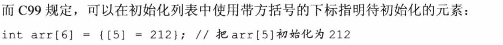
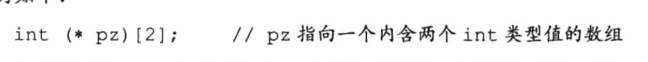
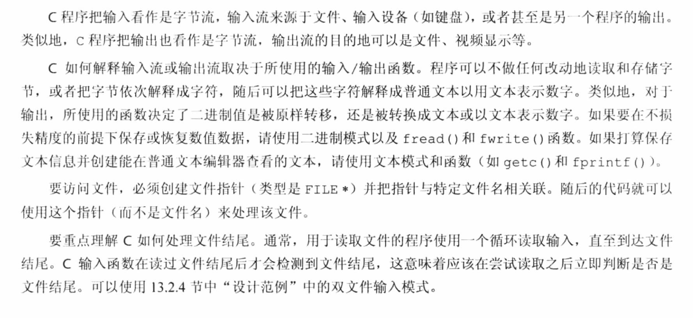

c学习笔记

事实上，防止数据溢出

1、在给一个变量赋值之前选择他的数据类型，需要确定这个数据的范围

2、浮点数计算考虑当前数据类型的精度

float有效数字会在6.7位

double类型的高一些在10以上

浮点型数据类型

float 8（指数值和符号）+24（精度）

double 8（指数值和符号）+56（精度）

long double

overflow

浮点数相乘超出类型的存储范围

将其printf为inf

chapter4：

关于字符串的一些知识，以及输入和输出

使用字符数组来存储字符串，每个字节一个字符值，字符数组的末尾字符\0表示字符串的结束，属于非打印字符

在scanf（）接收到第一个空白时候，就不在接受输入

字符和字符串的区别在于：

字符属于基本类型，而字符串属于派生类型的字符数组，末尾由\0结束

在使用sizeof和strlen来判断字符串的长度时：

sizeof根据数据类型确定他的存储空间大小

strlen确定实际占用的长度，不包括\0

良好的习惯：

全大写来表示这是一个符号常量

符号常量可以用来表示 数值 字符 和 字符串常量

cosnt关键字来限定一个变量为只读

可以看到c预处理器中，一些头文件的符号常量的值

转换说明的意义在于 翻译说明，更换了表达形式

printf的参数传递机制

计算机根据数值类型，在将参数的值存储在栈中后，printf函数依据转换说明从栈中读取值，存在错位的可能。

scanf使用指向变量的指针来作为输入参数

\*修饰符来限定printf和scanf的字段宽度

左值用来标识特定数据对象的名称和表达式

对象指的是实际的数据存储，左值更为贴切的名称为（对象定位值）

递增运算符

前缀a++ 表达式取值为加之前的

后缀++a 表达式取值为加之后的

递增or递减只能影响一个左值

递增/递减运算符

优先级比较高，但是不要对在一个表达式中多次出现的变量使用

语句与表达式的区别在于

语句会以;来作为结尾

C的主要目的是对表达式求值

副作用是将变量赋值，使用一些语句的主要目的就是

序列点：所有的副作用都在进入下一步之前发生，分号标记了一个序列点

c的类型转换，被赋值的对象可能会升级或者降级

避免自动的类型转换

循环语句一定要有终止，不要落入无限循环的陷阱哦，有时候考虑将循环变量放在入口条件while（n++<10）括号中的位置，避免无限循环

浮点数的误差在比较时尽量用和，作差会有误差

关系表达式的值为0 or 1对应真和假

将常量放在表达式的左侧，避免==输入错误为= ，因为不允许给常量赋值

while属于入口条件循环，在循环之前就知道是否执行循环

循环涉及的三个行为

1、初始化计数器

2、计数器和定值比较

3、每次循环时计数器递增（更新表达式，加减乘除）

奇妙的for循环

循环表达式 第一个表达式不一定是初始化变量，也可以是printf（），在执行循环体之前，只对第一个表达式求值1次

逗号运算符

逗号是一个序列点，逗号之前的所有副作用在执行逗号右侧之前完成，使得表达式从左到右求值

出口条件循环

do while

在迭代后检验循环条件 循环体的内容至少执行一次

数组  索引加下标访问数组元素

字符数组和字符串

函数声明 函数定义 函数调用

if 和else 之间只允许存在一条笔记

getchar（） 和putchar（）只处理字符，属于类似函数的宏

c语言的奇妙编程风格 将几个表达式合并为一个表达式 赋值 判断一体

isalpha（）函数来判断字符的类别

多重选择else if

符号常量来表示一些常量，预处理器不进行计算只是简单的替代

if  else二则

else if 属于if else 大框架下的嵌套

else 与上面最近的if来配对匹配

flag作为标记 在外层循环设置标记 循环完毕后检查标记值 来判断是否进入了循环

逻辑运算符&& || ！ 与 或 非

逻辑运算符存在备选拼写 逻辑表达式的求值顺序是从左到右

逻辑运算符可以作为序列点 在判断之前逻辑运算符之前的所有副作用已经完成

如果是bool型的变量

通常习惯把自身变量作为测试条件

条件运算符 唯一的三元运算符

continue和break 辅助循环

continue会跳过程序之后的部分 回到循环的开头

break比较直接 直接会退出循环

switch和break联合使用

switch的每一个case都必须有break

continue和break都是为了跳出循环来设计的

字符输入输出验证I/O

一些函数 scanf printf getchar putchar 等

如何告诉电脑结束输入

了解c如何处理键盘输入 其中的概念

缓冲，标准输入文件

键盘输入进入缓冲区，Enter后发送

缓冲分类：完全缓冲/行缓冲，完全缓冲等待缓冲区满后输出，行缓冲在接受到换行符后输出

结束键盘输入：

规定一个字符作为结束输入的标志

从概念上看 c程序处理的是 **stream 流** 而不是直接处理文件 ； scanf printf getchar putchar都属于是标准I/O包的成员，处理键盘输入流和屏幕输出流

文件结尾的检测

规定的字符 EOF （即为end of file）规定

\#define EOF -1

因为-1不属于任何字符，理解EOF为一个值，为检测到的文件结尾，已经在stdio.h中定义过了

重定向和文件

程序使用文件的两种方法

1：显式打开关闭处理

2：重定向输入到文件和从文件输出

第8章节的内容涉及到输入输出的验证比较难，我先选择跳过

第9章 函数

什么是函数

从功能方面来看，函数可以具备下面的两个功能

1：执行磨一类型的动作

2：返回某个值

这两种功能可以同时具备

函数的出现 解决了重复性的工作问题，也让我们的代码更加模块化，易于修改

函数有时候被看做黑盒，我们需要关注盒子的输入和输出，这样可以更多的把注意力放在整体的代码上

如何了解和使用函数，从正确定义函数，调用函数和建立函数之间的通信开始

一个程序中如果使用了函数，下面一定有关于函数的这三部分：

函数原型（也叫做函数声明）：告诉编译器函数的类型，一般定义了函数的返回值类型和函数所接受的参数的数据类型，这些也叫做函数的签名

函数调用：在程序的某一处执行函数，在调用完函数后，计算机返回主调函数（main）来继续执行下一行的代码

函数定义：指明函数的功能代码，与定义main类似，后面直接接上{}大括号

函数的定义可以和main（）放在同一个文件，也可以放在不同的文件中；当单独把函数定义在一个文件中时候，需要在预处理阶段#define和#include也放入该文件，这样方便在不同的文件中调用该函数

在函数体中定义的的变量属于局部变量，他的作用域仅仅属于函数体内部

函数参数

可以选择符号常量作为函数的参数

下面学习如何编写一个带有形式参数的函数

在函数声明阶段和函数定义阶段

void show\_n\_char(char ch,int num)；

void show\_n\_char(char ch,int num)

{

}

其中ch和num这两者属于形式参数，形式参数属于局部变量，属于函数私有

每个形式参数的类型都需要单独声明

在函数调用阶段

实际参数给函数声明中的形式参数传递了值，可以理解为：

形式参数时被调函数中的变量，实际参数是在主调函数中赋给被调函数的具体的值

实际参数的类型不管如何，都需要求值并传递给形式参数，通过返回值来让私有的值从被调函数传递到了主调函数

使用return从函数中返回值

被调函数的返回值传递信息给主调函数，驱动程序对该信息测试

被调函数的返回值可以赋值给变量，也可以作为表达式的一部分

主调函数将参数存储在栈中，被调函数从中读取这些参数，当参数类型不匹配时，会出现读取错误

所以，在函数声明阶段声明形参的类型十分重要的

无参数和未指定参数的函数原型

为了确保函数确实没有参数，在形参的位置键入void关键字

void show\_the\_name(void)

像是printf（）这样的函数，可能会有多个类型和数量的参数，可以使用部分原型

在stdag.h中提供了定义这种函数的方法

递归

C语言允许函数调用自己，结束递归是递归的难点

递归方法简单，效率没有循环高

不太好理解的时候，把多级递归当做多层的函数调用，不过每一层的函数结构都相同就是

每级的递归都有属于自己调用的变量，彼此是私有的

递归是逐级别返回的，不能直接跳级

关于调用递归前后的语句执行顺序

在递归之前的，按照顺序执行

在递归之后的，按照相反的顺序执行

递归和循环类似，需要终止递归的语句

尾递归。将递归的调用放在函数的末尾

每次递归都会创建一组变量，会占据更大的空间

因此循环会更具有优势

然而在倒序问题中，递归具有自己的优势

比如用二进制的数来表示十进制的数

第一个计算的余数是最后一个要打印的值

把函数原型放在头文件中，使用该函数时就不需要函数声明了；同样的，把#define定义在头文件中

面对一个项目 通常我们定义了三个文件

main函数的主文件，整体的框架思路

xxx.h的头文件，预处理阶段的符号常量和函数原型

函数文件，其中有函数定义的部分

可以看出主文件和函数文件都需要#include\<xxx.h>的头文件

查找地址&取地址符

指针是C语言的灵魂，用于存储变量的地址

介绍带有地址参数的函数

被调函数与主调函数的同名变量存储的地址不同，仅仅是简单的传值

想要更改主调函数中变量的值，必需通过取地址的方式‘

指针指向地址

ptr=\&pooh

将pooh地址的值传递给了指针变量ptr

在使用指针变量ptr之前，需要先声明，使用间接运算符\*

ptr=\&pooh

val=\*ptr

上面这两句的功能相当于val=pooh

使用地址和间接运算符可以实现赋值的功能

声明指针变量时，需要指明指针变量指向变量的类型

例如

int \*pi

char\*pc

float\*pf

分别代表指向int，char，float类型变量的指针

指针是一个新类型，不要理解为整型

有关于指针的转换说明%p

使用指针在函数之间通信，经典例子（交换两个数的值）

想要被调函数影响主调函数的值，只需要把主调函数中变量的地址给传递给被调函数就好了，因此被调函数的形参变量声明为指针类型的变量

在C++中，存在引用变量，但是c里面没有

数组和指针

数组的初始化

也可以使用const声明数组为常量，之后就只能读取不能修改数组内容

部分初始化的数组其余部分会初始化为0

数组的存储类别 类似于变量可以创建不同的存储类别

指定初始化器（C99）

给数组元素赋值

可以在声明数组之后，借助数组下标给数组元素赋值

一般采取循环的方式依次给数组元素赋值，不允许数组给数组直接赋值

关注数组的大小，防止索引超出数组边界导致数组越界

C99提出了变长数组VLA，允许数组的长度变化

多维数组

float rain\[5]\[12]

创建了一个主数组包含五个元素，每个元素是一个长度为12的数组

采用双重循环可以遍历二维数组中的元素

二维数组的初始化

指针和数组

数组表示法是在变相的使用指针

数组名是数组首个元素的地址

C语言中，指针＋1指的是增加一个存储单元，这也是指针必需声明指向对象类型的原因

使用指针形参

使用两个指针形参，一个指向数组开头，一个指向数组结尾，指针形参属于变量

指针表示法和数组表示法是等价的。在处理数组时，更倾向于使用数组表示法。

指针操作

*   赋值：&
*   解引用：\*
*   取值：可以有指向指针的指针\*ptr，其中存储的值为指针ptr的地址
*   与整数相加、相减：这里的相加相减都是会与数据类型的长度相乘乘后再移动指针
*   递增、递减
*   指针求差 ：指向同样一个数组的两个指针之间求差，可以计算二元素之前的距离
*   比较：使用关系运算符比较两个指针的值（指向相同类型的变量）

指针数组、函数指针、指向指针的指针数组、指向函数的指针数组

使用指针形参时有可能会对数组的元素错误的修改，如果不想要这样的话，在声明函数原型时，在指针前加入const关键字，这样在处理时会把数组视作常量而不可更改

const关键字的应用：

创建cosnt数组，const指针和指向cosnt的指针

指针常量，常量指针

如果指针指向数组头部，指针被限定为常量，不能通过指针修改指向对象的值，但是可以通过数组来修改，并且指针可以更改指向的对象

指向const的指针用在函数的形参列表中，表明函数不会通过指针来改变数据

可以把cosnt或者非cosnt的数值的地址给指向cosnt的指针

但是不能把cosnt数据的地址给非指向cosnt的指针

因此，对函数的形参使用cosnt可以保护数据，并用于处理cosnt数组

cosnt的位置决定了修饰的是指针指向的数据类型是常量还是指针本身是常量

例如声明一个指向固定位置的指针

int \* cosnt pc=rates；

这个指针指向了固定位置不能变更；

可以修改指向数据的值

还可以使用两次cosnt

cosnt int \* cosnt pc=ratses；

这样既不能修改指向的位置，也不能修改指向位置的值

多维数组中指针的应用

如果一个指针指向了多维数组的首地址，如何可以遍历数组内的元素呢

int zippo\[4]\[12];

zippo是这个数组的首地址

逻辑上zippo与\&zippo\[0]指向相同位置

区别在于 zippo占用两个int类型地址

而zippo\[0]占用一个int类型地址

因此在指针加1后，二者指向对象会不同

即zippo+1和zippo\[0]+1指向不同

解引用的双重间接（地址的地址or指针的指针）

zippo与\&zippo\[0]是相等的

zippo\[0]与\&zippo\[0]\[0]是相等的

因此从zippo到zippo\[0]\[0]需要

\*zippo==\&zippo\[0]\[0]

或者\*\*zippo==zippo\[0]\[0]

指向多维数组的指针

确保指针指向的数据类型与声明的指针的类型一致

可以创建指向包含多个数据的数据类型的指针

区别运算符的优先级

\[]的优先级高于\*

创建的数组指针

int \*pz(2);

创建了一个指向长度为2个int类型的数组

和创建的指针数组

int\*pz\[2]；

数组中有两个指向int类型的指针

安全性考虑

把cosnt指针赋值为非cosnt指针不安全

这样可以通过非cosnt指针修改cosnt指针指向的对象，cosnt就没有意义了

反过来，将非cosnt指针在一级解引用后赋值给cosnt指针

关于二维数组的指针声明

使用typedef 来声明二维数组指针

变长数组

在前面的二维数组指针声明中，由于需要指明指针指向对象的数据类型，一般数组的列数都会提前定义

如果想要处理一个任意大小的二维数组，c99新增了变长数组VLA

允许使用变量表述数组的维度

变长数组不能改变已经创建的数组的大小，是在创建数组时，可以指定数组的维度

变长数组的声明

变长数组允许动态内存分配，可以在程序运行时指定数组的大小；普通c数组都是静态分配，在编译时确定数组的大小

复合字面量

数组属于存储变量，复合字面量的形式类似于数组的初始化列表，有自己专属的数据类型

数组的声明

int diva\[2]={10,20};

复合字面量的声明

(int \[2]){10,20} 在这其中int \[2]是复合字面量的类型名

由于复合字面量是匿名的，必需在创建时同时使用它

复合字面量的类型名也代表首元素的地址

可以将复合字面量作为实参传递给形参

其实本质上和初始化后的数组一致，只是不需要创建数组

复合字面量只是提供临时需要的值，具有块作用域，离开块无法确定字面量是否存在

对于数组的加深理解

在c中，数组属于派生类型

将数组名作为实际参数时，传递给函数的是数组的首地址，不是整个数组

因此指针和数组名相对应

为了处理不同长度的数组

在函数形参列表中内置了 元素个数和数组首地址

字符串和字符串函数

字符串是以\0结尾的char数组

字符串字面量等于字符号常量 用双引号“”括起来

字符串常量属于静态存储类别，在程序的整个生命周期内存在

初始化字符串数组时，必需告示编译器需要多少空间

让编译器确定初始化字符数组的大小

初始化数组

字符串存在静态存储区，程序在开始时才会为数组分配内存空间，这时才把字符串的值赋给数组

因此数组首地址和指针地址在不同的存储区域，值不相同

指针属于可修改的左值可以++，但是数组名不行

数组元素属于变量，但是数组名不是变量

数组获取的是原始字符串的副本

指针使用错误可能对原始字符串更改

指针数组会比数组更省空间

字符串输入

如果想读取一个字符串，需要提前预留空间

分配空间：在声明变量时显式指明数组的大小

scanf和%s只能读取一个单词（遇到换行符\空白会停止），而gets可以读取一整行输入（直到遇到换行符）

gets和puts经常配合使用

gets只知道数组的首地址，不知道数组中有多少个元素，可能导致缓冲区溢出

找到gets的替代品

fgets和fputs

fgets通过第二个参数限制了输入的字符数来解决溢出的问题

第三个参数指明要读入的文件

实例如下

fputs在区督导文件结尾时（或者空行）返回一个空指针，一般为null来代替（0也可以）

使用缓冲的I\O在给fgets输入换行符之前，输入都存储在缓冲区，按下发送后，整行内容都发送给fgets；

对于输出，在输出换行符时换行

可以用fgets存储换行符

面对不想要的换行符

两种处理手段

1、将换行符替换成空字符

2、将换行符后的字符丢弃

空字符和空指针

空字符(\0)的字符编码是0

空指针（Null）有一个值

空字符是整数类型 空指针是指针类型 二者都可以用0来表示 但是是不同类型的0

scanf函数与fgets的区别在于如何确定字符串的末尾

scanf一第一个非空白字符作为开始，以第一个空白字符作为输入结束

或者（指定长度作为结束）

scanf返回一个整数值，等于其读取的项数或者EOF（文件结尾时返回EOF）

字符串输出

put fputs printf

puts在显示字符串时会自动加一个换行符

在遇到空字符时停止输出

fputs不会在末尾添加换行符

printf输出多个字符串更加简单

可以自定义输入输出函数

字符串函数

strlen统计字符串的长度

strcat用于拼接字符串

将第二个字符串拼接在第一个字符串的末尾

拼接时不知道第一个字符串能否容纳

因此有了strncat

比较字符串strcmp

按照机器排序序列进行比较字符串而非字符

strncmp 可以指定比较的位置

用于查找字符

strcpy拷贝字符串

接受两个字符串指针作为参数，指向源字符串的第二个指针可以声明为数组名、指针、字符串常量；指向源字符串副本的第一个指针应指向一个数据对象（数组）

返回值为一个指针，第一个参数的指针

strncpy更加谨慎，考虑了可容纳的最大字符数

sprintf 第一个参数指明目标字符串的地址，后面是多个源字符串，可以将其拼接

字符串排序

好的我现在有一堆的字符串，需要按照他们的首字母来排序

我的思路是：

1、接受字符串数组的位置

2、这个二维数组的行数为字符串个数

3、通过指针比较两个字符串的大小strcmp

4、交换两个字符串的位置

5、两层循环设计，

排序指针而非字符串:

这个程序的巧妙之处在于排序的是指向字符串的指针，而不是字符串本身

排序算法：

存储类别、链接和内存管理

通过内存管理指定变量的作用域和生命期

存储类别

标识符（变量名）：指定了存储方式和值

指定对象的表达式为左值

如：指针，表达式等

c语言中将一块内存成为对象，对象可以存储一个或者多个值

可以用存储期描述对象（对象在内存中保留的时间）

可以用【作用域】和【链接】描述标识符，【作用域】和【链接】表明了程序的哪些部分可以使用它

标识符，可以在多个文件汇总共享，特定文件的任意函数，特定函数，或只在函数的部分使用

对象可存在于程序的执行期，也可仅存在他所在函数的执行期，可以通过函数调用的方式显式分配和使用内存

三个关键概念

【作用域】【链接】【存储期】

【作用域】：

描述程序中可访问标识符的区域

包括：块作用域、函数作用域、函数原型作用域和文件作用域

块：是指一对花括号括起来的区域

函数形参的块作用域在函数体这个块

循环和条件控制的代码，也有块作用域

函数作用域：仅用于goto的标签，规定了标签的函数作用域

函数原型作用域：用于函数原型中的形参名，编译器在处理函数原型中的形参时，只关心类型，名称不必要与函数定义时一致

文件作用域：变量定义在函数的外面

也称作：全局变量

【链接】

C变量有三种属性：外部链接、内部链接、无链接

具有块作用域、函数作用域和函数原型作用域的都属于无链接变量

具有文件作用域的可以是外部链接或内部链接，外部链接可以在多个文件中使用，内部链接变量只能在一个翻译单元中使用

【翻译单元】编译器源代码和头文件都可以称作一个翻译单元

如何区分内部链接和外部链接static

【存储期】

C对象的四个存储期

静态：在程序执行期间一直存在 注意区分static表明的是文件的链接属性 所有的文件作用域都有静态属性

线程：程序被分为了多个线程 在线程执行时存在

自动：块的调用 自动分配 自动销毁 目前使用的局部变量都是自动类别 （很经典的 循环变量就可以作为块作用域 用完就被抛弃了喵）

（有一个有趣的情况是这样的 如果 内层块的变量与外层同名 在内层作用域内 会覆盖掉外层变量的作用 出去后又恢复了正常）

动态分配：

循环是整个块的子块 循环体是循环的子块

寄存器变量

寄存器在cpu中 运算的速度非常之块

但是寄存器变量存储在寄存器中而不是内存中 所以地址操作不起作用

静态变量

实际上，静态变量是说的整个变量在内存中的位置不会变

文件中具有静态存储期的变量 具有块作用域 无链接

局部静态变量 是具有块作用域的静态变量的一个别称

很好玩的一段程序

在这个里面 trystat函数的两个内部变量

fade在每次调用trystat时候都会初始化为1

而stay变量有关键字 statsic修饰 保留了值 因此会在函数调用结束时仍保留（记忆消失大法对我不起作用）

放在函数体的内部是为了表明私有 如果外部变量想要访问 可以在函数的返回值处留下形参接口

外部链接的静态变量

extern关键字可以创建外部变量

具有文件作用域外部链接静态存储区的静态变量简称外部变量

所有的文件都能访问哦

如果一个文件使用的外部变量存储在另一个文件中 需要用extern声明一下

定义变量和声明变量的区别

定义就是普通的定义了 声明变量 类似于引用别处定义的变量 需要使用extern关键字

只有程序使用多个文件编译时候

才能充分体现内部链接和外部链接的重要性

复杂的c程序由多个源代码文件组成 只有一个程序定义外部变量并初始化 其他的文件都是声明该外部变量获取使用权

存储类别说明符

auto register static extern  \_*Thread*\_Local typedef

其中 auto是自动类型 主要是为了区分开 因为块作用域中的变量本身就具有自动的属性

register也是块作用域的变量 主要是为了保护变量的地址 并且归类于寄存器类别

static限制了变量的访问 文件作用域和块作用域的区别在于 文件作用域的静态变量有内部链接 而 块作用域的静态变量没有内部链接

extern说明了该变量定义在了别处

函数的存储类别

一般函数默认为extern 方便调用 除非使用static关键字来限定为内部函数

很重要的一个程序设计的法则在于 按需知道法则  

一个函数所要实现的功能尽量在函数内部实现

rand()实现伪随机数的生成

分配内存：

前面的确定了变量的存储类型之后 自动确定了作用域和存储期

也可以通过库函数来管理

显式指定了内存位置

使用malloc（）

函数 来请求一块内存 该函数接受输入变量为所需的内存字节数 返回值为void类型的指针 做了自动类型适配

指向首地址 相当于数组名

free（）与malloc（）配套使用 在malloc（）征用了内存之后 由free（）来释放这一块内存  free（）的参数是一个指向malloc（）征用内存的指针

但是不能用free（）的方式来释放其他方式分配的内存

这个东西的好处在于非常灵活 可以调整所征用的数组的数量  

内存泄露 ：

很巧妙 在malloc征用了内存之后 没有free将内存释放 在指针销毁后 这些内存都处于不可访问的状态

calloc类似malloc 需要两个输入参数 存储单元数量 和存储单元的大小

存储类别和动态内存分配

静态内存程序执行期间都存在

自动变量通常以栈的形式 内存自动创建和销毁

动态分配的内存可以在不同的文件实现分配和销毁 通常放在内存堆（自由内存也叫）

头文件的好处是方便偷懒 但是不要什么大东西都往里面塞 会让速度变慢的

volatile关键字涉及到高速缓存 和寄存器的优化

内存中的数据怎么样对他们进行表征和区分

三个属性 作用域 存储期 和链接

作用域和链接基本表明了 这些数据能被谁访问，不能被谁访问 文件作用域（内部链接 外部链接） 局部作用域（） 块作用域（无链接）

c语言的5中存储类别

自动、寄存器、静态无链接、静态内部链接、静态外部链接

动态内存的分配由 malloc和free来决定

文件的输入输出

C语言要对文件交互

需要掌握和文件通信的方法

在C中 文件被认为是一段（可能分散）的已经命名的存储区

文件分为两种模式 文本模式和二进制模式

文件中以ascii码来表示 包含文本内容 文本模式

以机器码 包含二进制内容 二进制模式

标准I/O的工作机理

创建一个包含文件和缓冲区的数据结构 其中有文件位置的指针 缓冲区的指针 文件标识符 和计数

读取文件的过程 是调用输入函数 将内容充满缓冲区 然后将下一块内容放入缓冲区

关键概念 C程序把输入和输出看做是字节流 访问文件必需使用文件指针 C读过文件结尾后才检测到文件结尾
