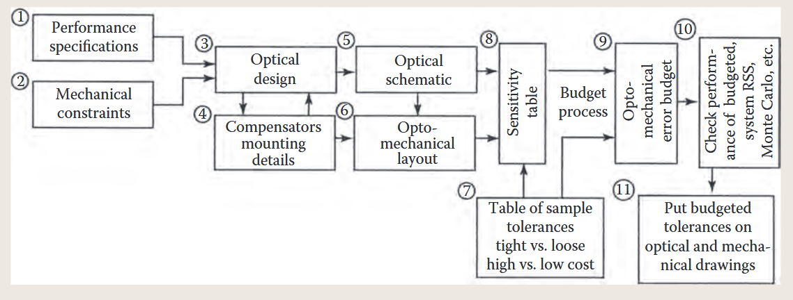

光机系统设计的读书笔记

## chapter1

光机设计过程

在工程上 不一定更精细的分析得到更精确的结果

公差是个十分重要的东西 及其敏感

这是在光机设计中公差分析的应用

对不同位置误差的灵敏度分析

给敏感位置小的公差 给不敏感的位置 大的公差

在确定设计需求 给出设计指标之后

我们首先进行了预设计

一次设计 和最终设计

公差分析敏感部件 随后联合机械系统 给出打样的方案

## chapter2

环境因素影响

环境敏感因素

温度 湿度 应力、压力 冲击 腐蚀

污染 、发霉

磨损 高能辐射

## chapter3

光机材料特性

一些光机材料的特性

光学玻璃 光学晶体 塑料 薄膜

反射镜材料

机械组件 主要是 铝 铜 因瓦合金

（镁 碳钢）

胶合剂 和密封件

### 光机零件制造技术

光学玻璃在制造过程中 退火不均匀 会在零件的外表面产生压应力 内部产生拉应力 在机加工时 零件表面会发生翘曲

折射材料

（吸附散射 存在损耗）

折射率随波长的变化为色散

温度 应力 导致镜片变形折射率发生了变化

光机系统中我们通常会关注的材料性能有：

【密度 杨氏模量 泊松比 】

【热膨胀系数 比热 热导率 】

【硬度】

可以看出 一方面考虑机械变形 一方面考虑热输入的影响

【转变温度】的定义

是指玻璃的【线性热膨胀系数】发生明显变化的温度

【阿贝数】 主要和色散相关

在设计时候需要控制色差

消除色差的同时可能引出其他的像差 需要综合校正

光学塑料

光学塑料具有优缺点

优点在于便宜 耐磨 模具成型块

缺点在于 塑料本身的 易软化 等性质

同时

【双折射】概念是指 折射率受到温度和机械应力的影响

光学塑料显然是双折射的

不存在高折射率的光学塑料 因此一般光学塑料的厚度要更厚（同等的焦距下）

光学镜片的面型误差怎么衡量（采用什么样的单位）

PV峰谷值

RMS面型的均方根误差

用波长λ来衡量

MYS微屈服应力

是材料产生1e-6的永久变形所需要的应力

是材料在低应力下的稳定性指标

基底材料的刚度 对镜片有显著的影响

比刚度 是材料刚度对重量的评价指标

热膨胀系数 不均匀性 导致镜头发生畸变

热变形指数α/k

其中α是热膨胀系数 k是热导率

希望更低的热膨胀系数 和更高的热导率

光机不需要高强度重量比的材料

在典型光机系统中材料的变形很小 远远没有到达屈服的地方

因此低强度的材料也能提供相同的刚度

铝合金材料都需要表面镀膜

期待高刚度 高热导率 轻量化的材料

异种材料之间可以添加有机薄膜来隔绝

镁合金有良好的阻尼特性 可用于隔震

复合材料 集合不同材料的优势

常用的PMCs【树脂聚合物】和MMCs

【金属基聚合物】

热固性和热塑性树脂

### 胶粘剂

【光学胶】和【结构胶】

【光学胶】用于胶合透镜

【结构胶】用于胶合光学元件和机械件

【结构胶】具有的优点在于

更低的重量 更易连接  密封性能

【环氧树脂】 热固性树脂

光机材料涂层

一层在光学元件表面的薄膜，作用有2

1：保护

2：增加or降低折射率or透射率

光学黑色涂层

评价指标 双向反射分布函数BRDF

## 单个透镜的安装
