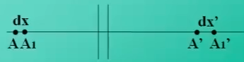
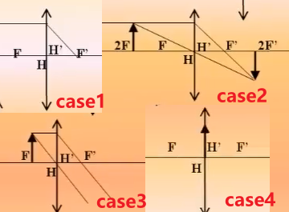
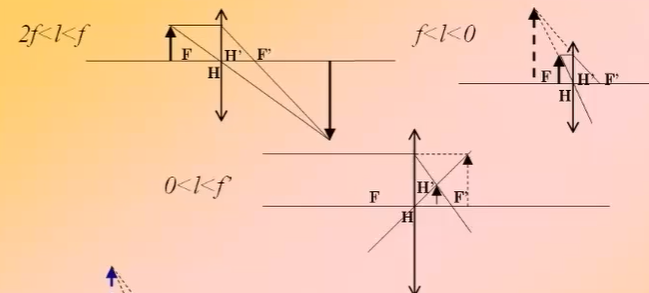
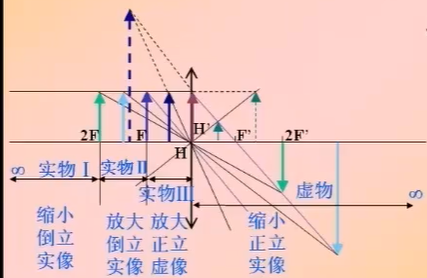
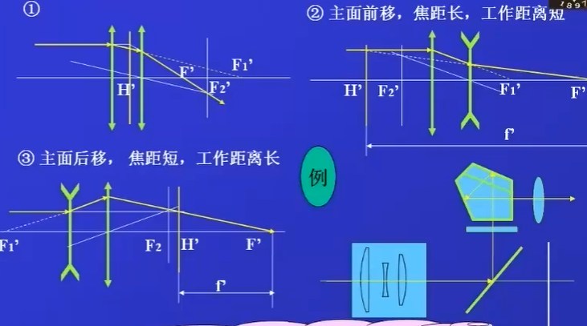
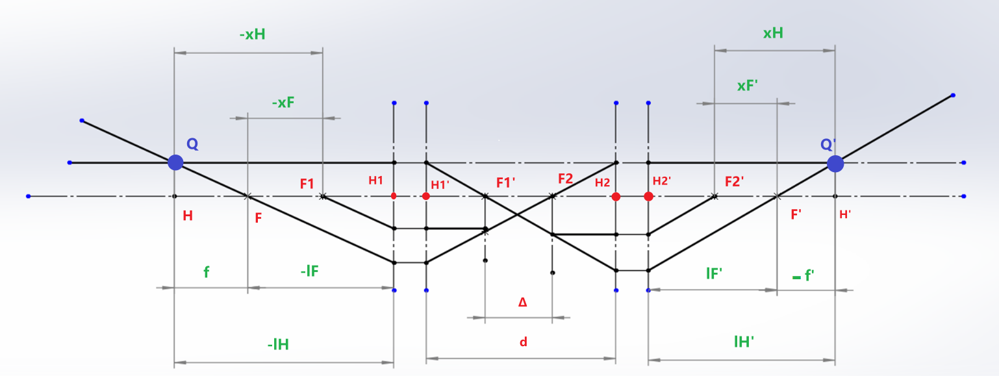

# 1. 应用光学的学习

## 1.1. 目录

[TOC]

## 1.2. 理想光学系统成像

理想向工程实际的过渡
一些重要的概念：基点 基面 光轴 光焦度

> 球面无法成 完善像 细光束 细小平面 成 完善像
> 实际光学系统 的成像 总是不完善的

---

### 1.2.1. 理想光学系统的基点与基面

> 从 理想光学系统 到 实际光学系统 再到 光学系统设计
> 从得到初始解 再开始优化设计

定义 理想光学系统 像和物是完全相似的

#### 1.2.1.1. 共轭关系

| 物空间 | 像空间   |
| ------ | -------- |
| 点     | 共轭点   |
| 直线   | 共轭直线 |
| 平面   | 共轭平面 |

---

#### 1.2.1.2. 焦点和焦平面

焦点和焦平面的示意图如下：
[^footnote焦点和焦平面]
[^footnote焦点和焦平面]:在图中有一些参数需要定义，-u 和 u'分别是入射角和出射角，在光学中正负号是以光轴为中心，转向光线，顺时针为正；同样的以法线为中心转动，顺时针为正

理想凸透镜
物焦点 和 像焦点 不是一对共轭点，物焦点 和 像面 是一对共轭，像焦点 和 物面 是一对共轭

---

#### 1.2.1.3. 主点和主平面

> 主点和主平面的定义，需要关注一个问题，焦距是如何定义的[^footnote1] > [^footnote1]: 如果你有一个很厚的透镜，你怎么去测量焦距呢？比较传统的方法是，将光束聚焦，这时候应该测量焦点到哪里的距离呢？

下面是主点和主平面的定义图：

测量一个镜头的焦距，解决 **测量基准** 的问题

关注 光线在哪里开始转弯？
两条 入射光线 交于一点 `Q` 物，两条 出射光线 交于一点 `Q'`像
这里 `Q` 和 `Q'`是一对共轭，经由 `Q` 和 `Q'`作垂线 交于 `H`和 `H'`，分别称作 物方主点 和 像方主点
`HQ`和 `H'Q'`物方主面 和 像方主面
共轭 且（横向放大率）$β=1$
在定义了 主点 之后，可以定义焦距了

> **光学系统 总是存在一对 主点（主平面） 和 焦点 （焦平面） 前者是共轭的 后者不是**

---

#### 1.2.1.4. 焦距和基点

定义焦距为焦点到对应主点的距离，定义为
\[\left\{ \begin{array}{l}
f' = \overline {{\rm{H'F}}} {\rm{'}}\\
f = {\rm{HF}}
\end{array} \right.\]

> 理想光学系统的前提：细光束以理想平面成像

> 只要一对主点，一对焦点的位置确定，一个光学系统的模型就确定了
> `H`、`H'`、`F`、`F`称为光学系统的基点
> 主点和主面的特点是，横向放大率$β=1$

---

#### 1.2.1.5. 节点和节平面

角放大率$\gamma=1$的一对共轭点
通俗的理解为，入射和出射的光方向不变

下面是节点和节平面的示意图：

> 当$f=-f'$时，节点和主点重合

怎么寻找节点是一个难题

---

### 1.2.2. 物像位置关系和三种放大率、两种焦距和光焦度

#### 1.2.2.1. 理想光学系统的物像位置关系和横向放大率

下面是理想光学系统横向放大率的示意图：

在图中，有横向放大率

- 以为`F`、`F'`为原点有

> \[\beta = \frac{{y'}}{y} = - \frac{f}{x} = - \frac{{x'}}{{f'}}\]

满足**牛顿公式**

> \[xx' = ff'\]

- 以`H`、`H'`为原点有
  将\[\left\{ \begin{array}{l}
  x = l - f\\
  x' = l' - f'
  \end{array} \right.\]代入得到**高斯公式**

> \[\frac{{f'}}{{l'}} + \frac{f}{l} = 1\]

此时有横向放大率

> \[\beta = - \frac{{fl'}}{{f'l}}\]

代入后面的公式有：\[ - \frac{{f'}}{f} = \frac{{n'}}{n}\]

可以得到更完备的高斯公式，类似单个球面镜的折射公式，具有普遍性[^单个球面镜的折射公式]

[^单个球面镜的折射公式]: 单个球面镜的折射公式为\[\frac{{n'}}{{l'}} - \frac{n}{l} = \frac{{n' - n}}{r} = \frac{{n'}}{{f'}} = - \frac{n}{f}\]

> \[\frac{{n'}}{{l'}} - \frac{n}{l} = \frac{{n'}}{{f'}} = - \frac{n}{f}\]

一些条件下的简化
在同种介质中$n=n'$的情况下，有
\[\frac{{1}}{{l'}} - \frac{1}{l} = \frac{{1}}{{f'}} \]
横向放大率，与单个透镜公式相同
\[\beta=\frac{{l'}}{{l}}\]

> 横向放大率和物体大小无关，和物体的位置有关[^畸变]

[^畸变]: 存在与物像大小有关的放大率，当发生畸变时，横向放大率和物体大小有关

---

#### 1.2.2.2. 理想光学系统的焦距关系和拉氏公式

根据三角形相似，在近轴区域有：$yfu=-y'f'u'$
结合拉氏不变量$nyu=n'y'u'$
得到两焦距的关系

> \[ \frac{{f'}}{f} = -\frac{{n'}}{n}\]

比较好玩的系统：卡塞格林系统如图

特点在于，焦距很长，镜筒可以很短

理想光学系统的拉氏公式：

> \[ nytanU=n'y'tanU' \]

---

#### 1.2.2.3. 光束的汇聚度和系统的光焦度

根据高斯公式：\[\frac{{n'}}{{l'}} - \frac{n}{l} = \frac{{n'}}{{f'}} = - \frac{n}{f}\]
得到折合后的

| 折合后   | 公式            | 倒数含义    |
| -------- | --------------- | ----------- |
| 折合物距 | $\frac{l}{n}$   | 会聚度 $V$  |
| 折合像距 | $\frac{l'}{n'}$ | 会聚度 $V'$ |
| 折合焦距 | $\frac{f}{n}$   | 光焦度 $Φ$  |

这里（-）表示发散，（+）表示会聚
光焦度的公式 $V'-V=Φ $，表征光学系统偏折光线的能力
光焦度的单位为 **屈光度**，以米为单位的焦距的倒数[^眼镜的度数]
[^眼镜的度数]:眼镜的度数是 屈光度 ×100

---

### 1.2.3. 轴向放大率、角放大率和横向放大率之间的关系

#### 1.2.3.1. 轴向放大率

> 轴向放大率定义为：像与物的沿轴移动距离之比

轴向放大率如图所示：

由牛顿公式 $xx'=ff'$ 求微分得到 $xdx'+x'dx=0$
因此轴向放大率：
\[ \alpha= \frac{dx'}{dx} = \frac{-x}{-x'} = - \frac{f'}{f}\beta^2 \]
因此

> \[ \alpha=\frac{n'}{n} \beta^2 \]

当 $n=n'$，时，有 $\alpha=\beta^2$ ，立体的物像不再相似

#### 1.2.3.2. 角放大率

> 角放大率定义为，像方物方的倾斜角的正切比值[^为什么是正切]

[^为什么是正切]: 之前简化后的角放大率之比都是 $\gamma=\frac{u'}{u}$ ，这里没有做简化

有：
\[ \gamma= \frac{tanU'}{tanU} = -\frac{f}{f'} \frac{1}{\beta} = \frac{n}{n'} \frac{1}{\beta} \]

当 $n=n'$，时，有 $\gamma=\frac{1}{\beta}$

#### 1.2.3.3. 薄透镜成像的情况

##### 1.2.3.3.1. 薄透镜的四种特殊位置

如图所示：

- case1
  物在无穷远处，像与像方焦面重合
  有 $\beta=0,\alpha=0,\gamma=\infty$
- case2
  物体在 2 倍的物方焦面处（**4f 系统**）[^为什么叫4f]
  [^为什么叫4f]:物与像之间的距离刚好是四倍的焦距

  > 实物成实像的最短距离

  有 $\beta=-1,\alpha=1,\gamma=-1$

- case3
  物与物方焦面重合，像在无穷远处
  有 $\beta=\infty,\alpha=\infty,\gamma=0$
- case4
  物与主面重合
  有 $\beta=1,\alpha=1,\gamma=1$

##### 1.2.3.3.2. 薄透镜成像的一般位置

在一般位置的情况：

[^物是怎么跑到透镜后面的]

[^物是怎么跑到透镜后面的]: 实际上物不能跑到后面，这种情况是虚物，一定有一个光学系统造成了虚物

##### 1.2.3.3.3. 薄透镜成像的规律

### 1.2.4. 理想光学系统成像准则

- 平行光轴光线聚焦后 过像方焦点
- 过物方焦点的光线经透镜后平行于光轴
- 过节点的光线方向不变
- 平行光线聚焦于像方焦面一点
- 过物方焦面上一点的光线经透镜后变为平行光

> **如何寻找主点的位置：**
> 针对多个光组的情况，平行于光轴的入射光线和出射光线延长线的交点，就是主点的位置。
> **如何寻找焦点的位置:**
> 出射光线和主光轴的焦点，就是组合焦点的位置

注意节点与主点不重合的情况[^关于图解法的说明]
[^关于图解法的说明]:图解法要求掌握物与像相互得到，典型的情况有：单光学系统或多光组的基点已知后，由物求像或者由像求物；已知两个光组的基点，求合成光组的基点；

#### 1.2.4.1. 几种比较有趣的结构

图中，图 2 表明一种焦距长的，近距结构；
图 3 表明一种焦距短的，远距结构；

> 工作距离的定义：
> 光学系统（如透镜、物镜、显微镜、相机镜头等）的前端表面到被观察物体或成像目标之间的清晰成像时的最短距离。

### 1.2.5. 光学系统的组合

> 这一章节的特点在于，通过计算得到组合光组的基点

> 注意，其中 $x_F$ , $x_H$ 表示到焦点的距离， $l_F$ , $l_H$ 表示到主面的距离， $Δ$ 表示光学间隔[^老师的总结]

[^老师的总结]: 里面 $x$ 总是以焦点为起点，$l$ 总是以主点为起点，注意正负号，这里得到了一个负的焦距；光学间隔$Δ$ 指的是，第一个光组的像方焦点到第二个光组的物方焦点的距离。

#### 1.2.5.1. 组合光组的主点求解

图中存在两组共轭点：

1.$F_1'$ 和 $F'$ 针对第二个光组是一对共轭点

2.$F_2$ 和 $F$ 针对第一个光组是一对共轭点

在这里可以应用牛顿公式： $xx'=ff'$
这里有 $\left\{ \begin{array}{l}
  x = \Delta \\
x' = \Delta
\end{array} \right.$ ，且$ \Delta=d-{f_1}^{'}+f_2$

因此：

> \[\left\{ \begin{array}{l}
> {x_F{'}} = - \frac{{{f_2}f_2^{'}}}{\Delta }\\
> {x_F} = \frac{{{f_1}f_1^{'}}}{\Delta }
> \end{array} \right.\]

且有

> \[\left\{ \begin{array}{l}
> f' = - \frac{{f_1^{'}f_2^{'}}}{\Delta }\\
> f = \frac{{{f_1}{f_2}}}{\Delta }
> \end{array} \right.\]

#### 1.2.5.2. 组合光组的放大率

一般已知条件 $x_1$ ，有 $x=x_1-x_F=x_1-\frac{f_1f_1'}{\Delta}$，由横向放大率：

\[ \beta=-\frac{f}{x}=\frac{f_1f_2'}{f_1f_1'-x_1\Delta} \]

在空气中，通常有 $f=-f'$ ，因此：

> \[ f'=\frac{f_1'f_2'}{f_1'+f_2'-d}\]

光焦度有：

> \[ \varphi=\frac{1}{f'}=\frac{f_1'+f_2'-d}{f_1'f_2'}=\varphi_1+\varphi_2-d\varphi_1\varphi_2\]

> 两个光组的总光焦度，和各自的光焦度相关，也其间隔 $d$ 有关

#### 1.2.5.3. 多光组组合的主点

> 重点关注平行入射的光线和出射光线的位置：将其转化为角度和高度去求解

这就是所谓的

1.**正切计算法**，初始条件为 $u_1=0$
还有计算方法

2.**截距计算法**，初始条件为，$l_1=-\infty$，反复应用高斯公式

3.**光焦度贡献计算法**，计算每个光组对总光焦度的贡献[^光焦度的贡献]
[^光焦度的贡献]:光组的光焦度除了和自身的光焦度有关，还和光组在系统中的位置是有关的

#### 1.2.5.4. 一些参数的定义

- 系统总长：
  第一个光组表面到达系统像方焦点的距离，也叫做镜筒长度。[^镜筒长度的理解]
  [^镜筒长度的理解]:非常合理，从第一个光组表面出发，能清晰成像的到达物的距离叫做工作距离，到达感光元件/像方焦点的距离，就是镜筒所需要的长度，根据系统长度和焦距的长短关系，分为了近距系统和远距系统。

- 物像共轭距：
  物和像之间的距离
