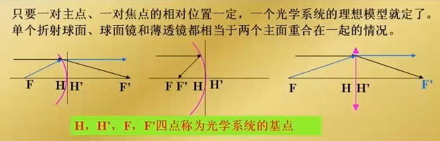
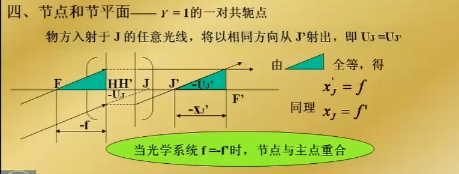
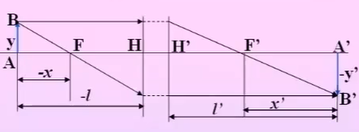
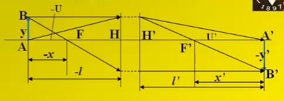
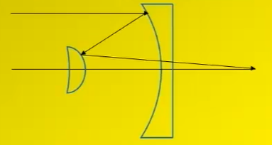

# 1. 应用光学的学习

## 1.1. 目录

[TOC]

## 1.2. 理想光学系统成像

理想向工程实际的过渡
一些重要的概念：基点 基面 光轴 光焦度

> 球面无法成 完善像 细光束 细小平面 成 完善像
> 实际光学系统 的成像 总是不完善的

### 1.2.1. 理想光学系统的基点与基面

> 从 理想光学系统 到 实际光学系统 再到 光学系统设计
> 从得到初始解 再开始优化设计

定义 理想光学系统 像和物是完全相似的

#### 1.2.1.1. 共轭关系

| 物空间 | 像空间   |
| ------ | -------- |
| 点     | 共轭点   |
| 直线   | 共轭直线 |
| 平面   | 共轭平面 |

#### 1.2.1.2. 焦点和焦平面

焦点和焦平面的示意图如下：
[^footnote焦点和焦平面]
[^footnote焦点和焦平面]:在图中有一些参数需要定义，-u 和 u'分别是入射角和出射角，在光学中正负号是以光轴为中心，转向光线，顺时针为正；同样的以法线为中心转动，顺时针为正

理想凸透镜
物焦点 和 像焦点 不是一对共轭点，物焦点 和 像面 是一对共轭，像焦点 和 物面 是一对共轭

#### 1.2.1.3. 主点和主平面

> 主点和主平面的定义，需要关注一个问题，焦距是如何定义的[^footnote1]
>
> [^footnote1]: 如果你有一个很厚的透镜，你怎么去测量焦距呢？比较传统的方法是，将光束聚焦，这时候应该测量焦点到哪里的距离呢？

[^footnote1]: 如果你有一个很厚的透镜，你怎么去测量焦距呢？比较传统的方法是，将光束聚焦，这时候应该测量焦点到哪里的距离呢？

下面是主点和主平面的定义图：

测量一个镜头的焦距，解决 **测量基准** 的问题

关注 光线在哪里开始转弯？
两条 入射光线 交于一点 `Q` 物，两条 出射光线 交于一点 `Q'`像
这里 `Q` 和 `Q'`是一对共轭，经由 `Q` 和 `Q'`作垂线 交于 `H`和 `H'`，分别称作 物方主点 和 像方主点
`HQ`和 `H'Q'`物方主面 和 像方主面
共轭 且（横向放大率）$β=1$
在定义了 主点 之后，可以定义焦距了

> **光学系统 总是存在一对 主点（主平面） 和 焦点 （焦平面） 前者是共轭的 后者不是**

#### 1.2.1.4. 焦距和基点

定义焦距为焦点到对应主点的距离，定义为
\[\left\{ \begin{array}{l}
f' = \overline {{\rm{H'F}}} {\rm{'}}\\
f = {\rm{HF}}
\end{array} \right.\]

> 理想光学系统的前提：细光束以理想平面成像

<<<<<<< HEAD

=======

> 只要一对主点，一对焦点的位置确定，一个光学系统的模型就确定了
> `H`、`H'`、`F`、`F`称为光学系统的基点
> 主点和主面的特点是，横向放大率$β=1$

#### 节点和节平面

角放大率$\gamma=1$的一对共轭点
通俗的理解为，入射和出射的光方向不变

下面是节点和节平面的示意图：

> 当$f=-f'$时，节点和主点重合

怎么寻找节点是一个难题

### 物像位置关系和三种放大率、两种焦距和光焦度

#### 理想光学系统的物像位置关系和横向放大率

下面是理想光学系统横向放大率的示意图：

在图中，有横向放大率

- 以为`F`、`F'`为原点有

> \[\beta = \frac{{y'}}{y} = - \frac{f}{x} = - \frac{{x'}}{{f'}}\]

满足**牛顿公式**

> \[xx' = ff'\]

- 以`H`、`H'`为原点有
  将\[\left\{ \begin{array}{l}
  x = l - f\\
  x' = l' - f'
  \end{array} \right.\]代入得到**高斯公式**

> \[\frac{{f'}}{{l'}} + \frac{f}{l} = 1\]

此时有横向放大率

> \[\beta = - \frac{{fl'}}{{f'l}}\]

代入后面的公式有：\[ - \frac{{f'}}{f} = \frac{{n'}}{n}\]

可以得到更完备的高斯公式，类似单个球面镜的折射公式，具有普遍性[^单个球面镜的折射公式]

[^单个球面镜的折射公式]: 单个球面镜的折射公式为\[\frac{{n'}}{{l'}} - \frac{n}{l} = \frac{{n' - n}}{r} = \frac{{n'}}{{f'}} = - \frac{n}{f}\]

> \[\frac{{n'}}{{l'}} - \frac{n}{l} = \frac{{n'}}{{f'}} = - \frac{n}{f}\]

一些条件下的简化
在同种介质中$n=n'$的情况下，有
\[\frac{{1}}{{l'}} - \frac{1}{l} = \frac{{1}}{{f'}} \]
横向放大率，与单个透镜公式相同
\[\beta=\frac{{l'}}{{l}}\]

> 横向放大率和物体大小无关，和物体的位置有关[^畸变]

[^畸变]: 存在与物像大小有关的放大率，当发生畸变时，横向放大率和物体大小有关

#### 理想光学系统的焦距关系和拉氏公式

根据三角形相似，在近轴区域有：$yfu=-y'f'u'$
结合拉氏不变量$nyu=n'y'u'$
得到两焦距的关系

> \[ \frac{{f'}}{f} = -\frac{{n'}}{n}\]

比较好玩的系统：卡塞格林系统如图

特点在于，焦距很长，镜筒可以很短

理想光学系统的拉氏公式：

> \[ nytanU=n'y'tanU' \]

#### 光束的汇聚度和系统的光焦度

根据高斯公式：\[\frac{{n'}}{{l'}} - \frac{n}{l} = \frac{{n'}}{{f'}} = - \frac{n}{f}\]
得到折合后的

| 折合后   | 公式            | 倒数含义    |
| -------- | --------------- | ----------- |
| 折合物距 | $\frac{l}{n}$   | 会聚度 _V_  |
| 折合像距 | $\frac{l'}{n'}$ | 会聚度 _V'_ |
| 折合焦距 | $\frac{f}{n}$   | 光焦度 Φ    |

这里（-）表示发散，（+）表示会聚
光焦度的公式 $V'-V=ϕ $，表征光学系统偏折光线的能力
光焦度的单位为 **屈光度**，以米为单位的焦距的倒数[^眼镜的度数]
[^眼镜的度数]:眼镜的度数是 屈光度 ×100

### 轴向放大率、角放大率和横向放大率之间的关系
>>>>>>> refs/remotes/origin/main
