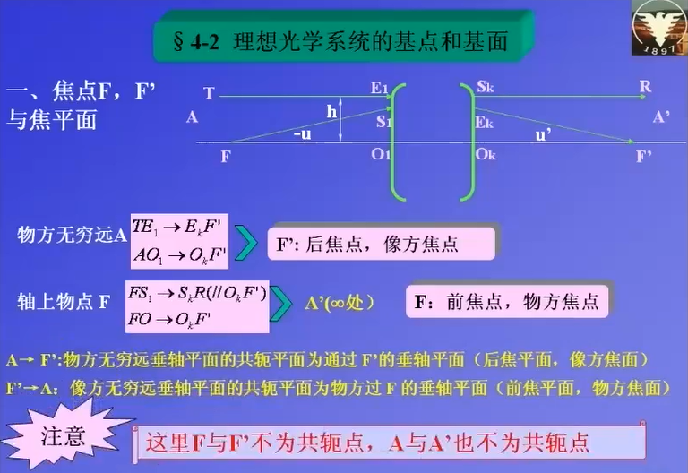
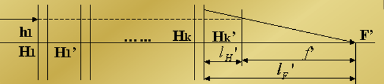
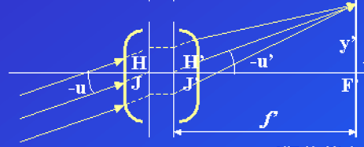
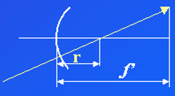
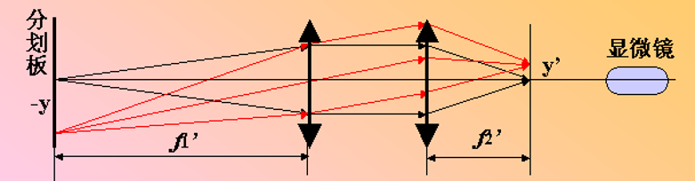
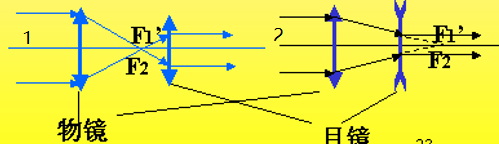

# 1. 应用光学的学习

## 1.1. 目录

[TOC]

## 1.2. 理想光学系统成像

理想向工程实际的过渡
一些重要的概念：基点 基面 光轴 光焦度

> 球面无法成 完善像 细光束 细小平面 成 完善像
> 实际光学系统 的成像 总是不完善的

---

### 1.2.1. 理想光学系统的基点与基面

> 从 理想光学系统 到 实际光学系统 再到 光学系统设计
> 从得到初始解 再开始优化设计

定义 理想光学系统 像和物是完全相似的

#### 1.2.1.1. 共轭关系

| 物空间 | 像空间   |
| ------ | -------- |
| 点     | 共轭点   |
| 直线   | 共轭直线 |
| 平面   | 共轭平面 |

---

#### 1.2.1.2. 焦点和焦平面

焦点和焦平面的示意图如下：
[^footnote焦点和焦平面]
[^footnote焦点和焦平面]:在图中有一些参数需要定义，-u 和 u'分别是入射角和出射角，在光学中正负号是以光轴为中心，转向光线，顺时针为正；同样的以法线为中心转动，顺时针为正

理想凸透镜
物焦点 和 像焦点 不是一对共轭点，物焦点 和 像面 是一对共轭，像焦点 和 物面 是一对共轭

---

#### 1.2.1.3. 主点和主平面

> 主点和主平面的定义，需要关注一个问题，焦距是如何定义的[^footnote1]

[^footnote1]: 如果你有一个很厚的透镜，你怎么去测量焦距呢？比较传统的方法是，将光束聚焦，这时候应该测量焦点到哪里的距离呢？

下面是主点和主平面的定义图：

测量一个镜头的焦距，解决 **测量基准** 的问题

关注 光线在哪里开始转弯？
两条 入射光线 交于一点 `Q` 物，两条 出射光线 交于一点 `Q'`像
这里 `Q` 和 `Q'`是一对共轭，经由 `Q` 和 `Q'`作垂线 交于 `H`和 `H'`，分别称作 物方主点 和 像方主点
`HQ`和 `H'Q'`物方主面 和 像方主面
共轭 且（横向放大率）$β=1$
在定义了 主点 之后，可以定义焦距了

> **光学系统 总是存在一对 主点（主平面） 和 焦点 （焦平面） 前者是共轭的 后者不是**

---

#### 1.2.1.4. 焦距和基点

定义焦距为焦点到对应主点的距离，定义为
\[\left\{ \begin{array}{l}
f' = \overline {{\rm{H'F}}} {\rm{'}}\\
f = {\rm{HF}}
\end{array} \right.\]

> 理想光学系统的前提：细光束以理想平面成像

> 只要一对主点，一对焦点的位置确定，一个光学系统的模型就确定了
> `H`、`H'`、`F`、`F`称为光学系统的基点
> 主点和主面的特点是，横向放大率$β=1$

---

#### 1.2.1.5. 节点和节平面

角放大率$\gamma=1$的一对共轭点
通俗的理解为，入射和出射的光方向不变

下面是节点和节平面的示意图：

> 当$f=-f'$时，节点和主点重合

怎么寻找节点是一个难题

---

### 1.2.2. 物像位置关系和三种放大率、两种焦距和光焦度

#### 1.2.2.1. 理想光学系统的物像位置关系和横向放大率

下面是理想光学系统横向放大率的示意图：

在图中，有横向放大率

- 以为`F`、`F'`为原点有

> \[\beta = \frac{{y'}}{y} = - \frac{f}{x} = - \frac{{x'}}{{f'}}\]

满足**牛顿公式**

> \[xx' = ff'\]

- 以`H`、`H'`为原点有
  将\[\left\{ \begin{array}{l}
  x = l - f\\
  x' = l' - f'
  \end{array} \right.\]代入得到**高斯公式**

> \[\frac{{f'}}{{l'}} + \frac{f}{l} = 1\]

此时有横向放大率

> \[\beta = - \frac{{fl'}}{{f'l}}\]

代入后面的公式有：\[ - \frac{{f'}}{f} = \frac{{n'}}{n}\]

可以得到更完备的高斯公式，类似单个球面镜的折射公式，具有普遍性[^单个球面镜的折射公式]

[^单个球面镜的折射公式]: 单个球面镜的折射公式为\[\frac{{n'}}{{l'}} - \frac{n}{l} = \frac{{n' - n}}{r} = \frac{{n'}}{{f'}} = - \frac{n}{f}\]

> \[\frac{{n'}}{{l'}} - \frac{n}{l} = \frac{{n'}}{{f'}} = - \frac{n}{f}\]

一些条件下的简化
在同种介质中$n=n'$的情况下，有
\[\frac{{1}}{{l'}} - \frac{1}{l} = \frac{{1}}{{f'}} \]
横向放大率，与单个透镜公式相同
\[\beta=\frac{{l'}}{{l}}\]

> 横向放大率和物体大小无关，和物体的位置有关[^畸变]

[^畸变]: 存在与物像大小有关的放大率，当发生畸变时，横向放大率和物体大小有关

---

#### 1.2.2.2. 理想光学系统的焦距关系和拉氏公式

根据三角形相似，在近轴区域有：$yfu=-y'f'u'$
结合拉氏不变量$nyu=n'y'u'$
得到两焦距的关系

> \[ \frac{{f'}}{f} = -\frac{{n'}}{n}\]

比较好玩的系统：卡塞格林系统如图

特点在于，焦距很长，镜筒可以很短

理想光学系统的拉氏公式：

> \[ nytanU=n'y'tanU' \]

---

#### 1.2.2.3. 光束的汇聚度和系统的光焦度

根据高斯公式：\[\frac{{n'}}{{l'}} - \frac{n}{l} = \frac{{n'}}{{f'}} = - \frac{n}{f}\]
得到折合后的

| 折合后   | 公式            | 倒数含义         |
| -------- | --------------- | ---------------- |
| 折合物距 | $\frac{l}{n}$   | 会聚度 $V$       |
| 折合像距 | $\frac{l'}{n'}$ | 会聚度 $V'$      |
| 折合焦距 | $\frac{f}{n}$   | 光焦度 $\varphi$ |

这里（-）表示发散，（+）表示会聚
光焦度的公式 $V'-V=\varphi $，表征光学系统偏折光线的能力
光焦度的单位为 **屈光度**，以米为单位的焦距的倒数[^眼镜的度数]
[^眼镜的度数]:眼镜的度数是 屈光度 ×100

---

### 1.2.3. 轴向放大率、角放大率和横向放大率之间的关系

#### 1.2.3.1. 轴向放大率

> 轴向放大率定义为：像与物的沿轴移动距离之比

轴向放大率如图所示：

由牛顿公式 $xx'=ff'$ 求微分得到 $xdx'+x'dx=0$
因此轴向放大率：
\[ \alpha= \frac{dx'}{dx} = \frac{-x}{-x'} = - \frac{f'}{f}\beta^2 \]
因此

> \[ \alpha=\frac{n'}{n} \beta^2 \]

当 $n=n'$，时，有 $\alpha=\beta^2$ ，立体的物像不再相似

#### 1.2.3.2. 角放大率

> 角放大率定义为，像方物方的倾斜角的正切比值[^为什么是正切]

[^为什么是正切]: 之前简化后的角放大率之比都是 $\gamma=\frac{u'}{u}$ ，这里没有做简化

有：
\[ \gamma= \frac{tanU'}{tanU} = -\frac{f}{f'} \frac{1}{\beta} = \frac{n}{n'} \frac{1}{\beta} \]

当 $n=n'$，时，有 $\gamma=\frac{1}{\beta}$

#### 1.2.3.3. 薄透镜成像的情况

##### 1.2.3.3.1. 薄透镜的四种特殊位置

如图所示：

- case1
  物在无穷远处，像与像方焦面重合
  有 $\beta=0,\alpha=0,\gamma=\infty$
- case2
  物体在 2 倍的物方焦面处（**4f 系统**）[^为什么叫4f]
  [^为什么叫4f]:物与像之间的距离刚好是四倍的焦距

  > 实物成实像的最短距离

  有 $\beta=-1,\alpha=1,\gamma=-1$

- case3
  物与物方焦面重合，像在无穷远处
  有 $\beta=\infty,\alpha=\infty,\gamma=0$
- case4
  物与主面重合
  有 $\beta=1,\alpha=1,\gamma=1$

##### 1.2.3.3.2. 薄透镜成像的一般位置

在一般位置的情况：

[^物是怎么跑到透镜后面的]

[^物是怎么跑到透镜后面的]: 实际上物不能跑到后面，这种情况是虚物，一定有一个光学系统造成了虚物

##### 1.2.3.3.3. 薄透镜成像的规律

### 1.2.4. 理想光学系统成像准则

- 平行光轴光线聚焦后 过像方焦点
- 过物方焦点的光线经透镜后平行于光轴
- 过节点的光线方向不变
- 平行光线聚焦于像方焦面一点
- 过物方焦面上一点的光线经透镜后变为平行光

> **如何寻找主点的位置：**
> 针对多个光组的情况，平行于光轴的入射光线和出射光线延长线的交点，就是主点的位置。
> **如何寻找焦点的位置:**
> 出射光线和主光轴的焦点，就是组合焦点的位置

注意节点与主点不重合的情况[^关于图解法的说明]
[^关于图解法的说明]:图解法要求掌握物与像相互得到，典型的情况有：单光学系统或多光组的基点已知后，由物求像或者由像求物；已知两个光组的基点，求合成光组的基点；

#### 1.2.4.1. 几种比较有趣的结构

图中，图 2 表明一种焦距长的，近距结构；
图 3 表明一种焦距短的，远距结构；

> 工作距离的定义：
> 光学系统（如透镜、物镜、显微镜、相机镜头等）的前端表面到被观察物体或成像目标之间的清晰成像时的最短距离。

### 1.2.5. 光学系统的组合

> 这一章节的特点在于，通过计算得到组合光组的基点

> 注意，其中 $x_F$ , $x_H$ 表示到焦点的距离， $l_F$ , $l_H$ 表示到主面的距离， $Δ$ 表示光学间隔[^老师的总结]

[^老师的总结]: 里面 $x$ 总是以焦点为起点，$l$ 总是以主点为起点，注意正负号，这里得到了一个负的焦距；光学间隔$Δ$ 指的是，第一个光组的像方焦点到第二个光组的物方焦点的距离。

#### 1.2.5.1. 组合光组的主点求解

图中存在两组共轭点：

1.$F_1'$ 和 $F'$ 针对第二个光组是一对共轭点

2.$F_2$ 和 $F$ 针对第一个光组是一对共轭点

在这里可以应用牛顿公式： $xx'=ff'$
这里有 $\left\{ \begin{array}{l}
  x = \Delta \\
x' = \Delta
\end{array} \right.$ ，且$ \Delta=d-{f_1}^{'}+f_2$

因此：

> \[\left\{ \begin{array}{l}
> {x_F{'}} = - \frac{{{f_2}f_2^{'}}}{\Delta }\\
> {x_F} = \frac{{{f_1}f_1^{'}}}{\Delta }
> \end{array} \right.\]

且有

> \[\left\{ \begin{array}{l}
> f' = - \frac{{f_1^{'}f_2^{'}}}{\Delta }\\
> f = \frac{{{f_1}{f_2}}}{\Delta }
> \end{array} \right.\]

#### 1.2.5.2. 组合光组的放大率

一般已知条件 $x_1$ ，有 $x=x_1-x_F=x_1-\frac{f_1f_1'}{\Delta}$，由横向放大率：

\[ \beta=-\frac{f}{x}=\frac{f_1f_2'}{f_1f_1'-x_1\Delta} \]

在空气中，通常有 $f=-f'$ ，因此：

> \[ f'=\frac{f_1'f_2'}{f_1'+f_2'-d}\]

光焦度有：

> \[ \varphi=\frac{1}{f'}=\frac{f_1'+f_2'-d}{f_1'f_2'}=\varphi_1+\varphi_2-d\varphi_1\varphi_2\]
> 两个光组的总光焦度，和各自的光焦度相关，也其间隔 $d$ 有关

#### 1.2.5.3. 多光组组合的主点

如图：

> 重点关注平行入射的光线和出射光线的位置：将其转化为角度和高度去求解

有

> \[\left\{ \begin{array}{l}
> f' = \frac{{{h_1}}}{{{u_k}}}\\
> {l_F}' = \frac{{{h_k}}}{{{u_k}}}\\
> {l_H}' = {l_F}' - f'
> \end{array} \right.\]

由于高斯公式 $$\frac{1}{l'}-\frac{1}{l}=\frac{1}{f'}$$
可以得到 $$\frac{h}{l'}-\frac{h}{l}=\frac{h}{f'}$$
也就是

> $$ u'-u=\frac{h}{f'} $$

可以得到递推关系式
\[ \left \{ \begin{array}{l}
u_1'-u_1=\frac{h_1}{f_1'}\\
u_2'-u_2=\frac{h_2}{f_2'}\\
\cdot\cdot\cdot
\end{array}\right.\]

有过渡公式：

> $u'_1=u_2$
> $h_2=h_1'-d_1u_1' $

这就是所谓的

1.**正切计算法**，初始条件为 $u_1=0$，$h_1$任意
迭代角度和高度如下：
\[ \left \{ \begin{array}{l}
u_1'=u_1+\frac{h_1}{f_1'},h_2=h_1'-d_1u_1'\\
u_2'=u_1'+\frac{h_2}{f_2'},h_3=h_2'-d_2u_2'\\
\dots\\
u_k'=u_{k-1}{'}+\frac{h_k}{f_k'},h_k=h_{k-1}'-d_{k-1}u_{k-1}'
\end{array}\right.\]

还有计算方法

2.**截距计算法**，初始条件为，$l_1=-\infty$，反复应用高斯公式，求解出截距$l_k$和$l_k'$
\[f'=\frac{h_1}{u_k'}=\frac{h_1}{u_1'}\cdot\frac{u_2u_3 \cdots u_k
}{u_2'u_3' \cdots u_k'}=\frac{l_1'l_2' \cdots l_k'}{l_2l_3 \cdots l_k}\]

3.**光焦度贡献计算法**，令$u_1=0$计算每个光组对总光焦度的贡献[^光焦度的贡献]
[^光焦度的贡献]:光组的光焦度除了和自身的光焦度有关，还和光组在系统中的位置是有关的

\[ \left \{ \begin{array}{l}
u_1'=\frac{h_1}{f_1'}\\
u_2'=\frac{h_1}{f_1'}+\frac{h_2}{f_2'}\\
\cdots\\
u_k'=\sum_{i=1}^k{\frac{h_i}{f_i'}}
\end{array}\right.\]
则系统的光焦度$$\varphi=\frac{u_k'}{h_1}=\frac{1}{h_1}\sum_{i=1}^k{\frac{h_i}{f_i'}}=\frac{1}{h_1}\sum_{i=1}^k{h_i\varphi_{i}}$$

#### 1.2.5.4. 一些参数的定义

- 系统总长：
  第一个光组表面到达系统像方焦点的距离，也叫做镜筒长度。[^镜筒长度的理解]
  [^镜筒长度的理解]:非常合理，从第一个光组表面出发，能清晰成像的到达物的距离叫做工作距离，到达感光元件/像方焦点的距离，就是镜筒所需要的长度，根据系统长度和焦距的长短关系，分为了近距系统和远距系统。

- 物像共轭距：
  物和像之间的距离

#### 1.2.5.5. 光学系统焦距测定

光学焦距的测量市分行总要，在光学零件图上要标出；
在测量焦距的过程中，焦点的位置比较好找到，但是主点的位置不方便找；
在介质相同情况下，利用**节点和主点重合**的性质，找到节点位置，就确定了主点的位置。
如下图，轴外平行光实现焦距测量：[^搞摄影的关注什么]
[^搞摄影的关注什么]:通常不会关注焦距，只关心视野，可以有多大的视场角，这里$W$为视场角；焦距和视场角之间存在一个固定的关系

$$y'=-f'tanu'=-f'tanu$$

该方法存在一定的局限性，主在折射球面顶点，光线过球心时，计算公式为：$y'=(f'-r)tan(-W)$

$$f_2'=\frac{y'}{y}f_1' $$

>注意：负透镜的焦距测量需要满足条件，像面的位置小于显微镜的工作距离

#### 1.2.5.6. 望远镜系统

光学系统的两种情况：
1、有限的焦距
2、平行射入，平行射出——望远镜系统

根据光组的组合焦距公式， $$f=-\frac{f_1'f_2'}{\Delta}=\infty $$
可以知道，$\Delta=0$，即光学间隔为0，前一个光组的像方焦点和后一个光组的物方焦点重合。

##### 1.2.5.6.1. $\beta、\gamma 、\alpha$的计算

针对左图1，有横向放大率

>$$ \beta=-\frac{f_2'}{f_1'} $$

可以看出，横向放大率和物距没有关系。

同样的，轴向放大率和角放大率有：

$$ \alpha=\frac{f_2f_2'}{f_1f_1'} ， \gamma=\frac{f_1}{f_2'}  $$

依然满足关系 $\alpha=\beta^2 , \gamma=\frac{1}{\beta} , \alpha\gamma=\beta $

##### 1.2.5.6.2. 视觉放大率

用望远镜观察物体，怎么确定这个物体被放大了？
人对物体主观的大小，和视角有关，因此，目视光学仪器采用**视觉放大率**。
有 $$ \Gamma=\frac{tanU'}{tanU} $$
其中，$U'$和$U$分别是物体经仪器对人眼张角一半和物体直接对人眼张角的一半。
因此，$$ \Gamma=\frac{tanU'}{tanU}=-\frac{f_1'}{f_2'} $$
所以，望远镜上面标注的是角放大率。

##### 1.2.5.6.3. 望远镜的组合形式

1.要求放大条件，$ \vert f_1' \vert > \vert f_2' \vert $
2.可能的两种情况：

- $ f_2' > 0 $，这时成倒像，有实像方便测量；
- $ f_2' < 0 $，这时成正像，无实像不方便测量；

3.在 $ \vert f_1' \vert > \vert f_2' \vert $ 的情况下，放大率有这样的关系：
$$ \vert \alpha \vert <<1，\vert \beta \vert <1$$
望远镜成倒立缩小的像，但是距离拉近很多。

##### 1.2.5.6.4. 望远镜系统的组合

1.望远镜系统+望远镜系统=望远镜系统
横向放大率相乘，得到了总的横向放大率。
2.望远镜系统+有限焦距系统
形成的等效系统，将焦距扩大了 $\Gamma$ 倍：[^有趣的科普]
[^有趣的科普]:数码相机的附加镜头，有广角镜头和增距镜头，广角镜头相当于一个倒置的望远镜，增距镜头相当于增加焦距；打鸟专属装备。

$$ f'=\frac{h_1}{u'}= \frac{h_1}{h_2} \cdot \frac{h_2}{u'} = \Gamma f_2' $$

### 1.2.6. 透镜

#### 1.2.6.1. 透镜分类

- 球面镜：（平面也是一种特殊的球面）
- 非球面镜  （在成像质量有提升 ）
- 凸透镜和凹透镜：依据中心厚度和边缘厚度区分为（双凸/凹，平凸/凹，月凸/凹）
  
>考虑问题时通常令$d=0$，这就是所谓的薄透镜，物方和像方的介质是相同的

#### 1.2.6.2. 薄透镜

薄透镜的主点重合，节点重合
物像位置关系：
$$ \frac{1}{l'}-\frac{1}{l}=\frac{1}{f'} $$
光焦度的计算：
$$ \varphi=\frac{1}{f'}=(n-1)（\frac{1}{r_1}-\frac{1}{r_2}） $$
共轭距：
$$L=\vert l'-l \vert=\vert (2-\beta-\frac{1}{\beta}) f'\vert $$
成像的最小共轭距为$4f'$
>薄透镜的主点就在两个顶点处

#### 1.2.6.3. 厚透镜

针对厚透镜，看做两个薄光组的组合，还有平行平板的加入。
厚的月凹透镜在校正像差时有作用，其余的厚透镜没有太多实际意义。

### 小结

- 理想光学系统的基点和基面
- 物像关系，放大率和拉氏不变量
- 作图法
- 光组组合，变化很多，长焦短工作距离，短焦长工作距离
- 测焦距
- 望远镜
- 薄透镜、厚透镜以及组合

## 光学系统的光束限制

理想光学系统，对于成像的物没有任何限制；可以对无穷大的物以无穷大的孔径成像。然而，实际光学系统并非如此，实际光学系统总有大小的限制。

### 